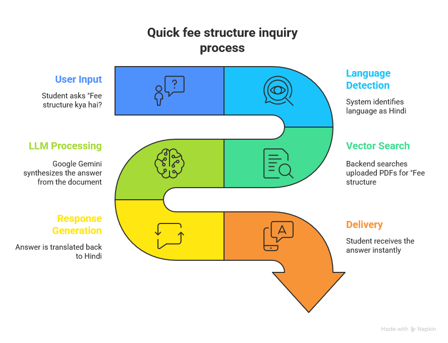

# Campus Assistant - Multilingual AI Chatbot

> 🏆 **TechSprint 2025 - GDGOC Hackathon** | Track: EdTech | Team: Valo Prophets

A **language-agnostic AI chatbot** for educational institutions that answers student queries in **7+ Indian languages** including Hindi, English, Gujarati, Marathi, Punjabi, Tamil, and Rajasthani. Built with Google Gemini AI.

## 🎯 Problem Statement

Campus offices answer hundreds of repetitive queries—fee deadlines, scholarship forms, timetable changes—often from students more comfortable in Hindi or other regional languages. This chatbot deflects routine inquiries, freeing staff for complex tasks while providing instant, accurate responses in the student's preferred language.

## 🌟 Key Highlights

- **Google AI Powered**: Uses Google Gemini (gemini-2.5-flash) for intelligent responses
- **Truly Multilingual**: 7+ Indian languages with automatic translation
- **RAG Technology**: Retrieval Augmented Generation for accurate, context-aware answers
- **Easy to Deploy**: Docker-ready, works on low-resource servers
- **Zero Translation Cost**: Uses free Google Translate via deep-translator

## Features

- **Multilingual Support**: Hindi, English, Gujarati, Marathi, Punjabi, Tamil, Rajasthani
- **Document Ingestion**: Upload PDFs, DOCX files for knowledge base
- **FAQ Management**: Easy-to-manage FAQ database with admin panel
- **RAG-based Q&A**: Intelligent answers using Retrieval Augmented Generation
- **Multi-turn Conversations**: Context-aware follow-up support
- **Human Escalation**: Automatic escalation for complex queries
- **Platform Integration**: Web app and optional Telegram bot
- **Analytics Dashboard**: Conversation logs and usage metrics

## 📸 Screenshots

### Chat Interface


### Admin Panel


## Architecture


```
┌─────────────────────────────────────────────────────────────────────┐
│                        CLIENT LAYER                                 │
├───────────────┬───────────────┬───────────────┬─────────────────────┤
│  Web App      │   Telegram    │ Future WhatsApp│ College Website    │
└───────────────┴───────────────┴───────────────┴─────────────────────┘
                                │
                                ▼
┌─────────────────────────────────────────────────────────────────────┐
│                      API GATEWAY (FastAPI)                          │
└─────────────────────────────────────────────────────────────────────┘
                                │
        ┌───────────────────────┼───────────────────────┐
        ▼                       ▼                       ▼
┌───────────────┐     ┌─────────────────┐     ┌─────────────────┐
│   Language    │     │     Intent      │     │    Context      │
│   Detection   │───▶ │   Recognition  │────▶│   Management    │
│  (Bhashini)   │     │   (RAG + LLM)   │     │ (Session Store) │
└───────────────┘     └─────────────────┘     └─────────────────┘
                                │
                                ▼
┌─────────────────────────────────────────────────────────────────────┐
│                       KNOWLEDGE BASE                                │
├───────────────────┬─────────────────────┬───────────────────────────┤
│  Document Store   │     Vector DB       │     FAQ Database          │
│  (PDFs, Circulars)│     (ChromaDB)      │      (SQLite)             │
└───────────────────┴─────────────────────┴───────────────────────────┘
```

## 🔄 Process Flow



## 🛠️ Tech Stack (Google Technologies)

| Component | Technology |
|-----------|------------|
| Backend | Python 3.11+, FastAPI |
| Frontend | Next.js 14, Tailwind CSS |
| LLM | Google Gemini or OpenAI, configured with `LLM_MODEL` |
| Translation | deep-translator (FREE - no API key needed) |
| Vector DB | ChromaDB |
| Database | SQLite (dev) / PostgreSQL (prod) |
| Embeddings | sentence-transformers/paraphrase-multilingual-MiniLM-L12-v2 |
| RAG Pipeline | LangChain |

## Quick Start

### Prerequisites

- Python 3.11+
- Node.js 18+
- Google API Key (for Gemini)

### Backend Setup

```bash
cd backend

# Create virtual environment
python -m venv venv
source venv/bin/activate  # On Windows: venv\Scripts\activate

# Install dependencies
pip install -r requirements.txt

# Copy environment config
cp .env.example .env
# Edit .env and add your API keys

# For existing databases, run migrations
alembic upgrade head

# Run the server
uvicorn app.main:app --reload --port 8000
```

### Frontend Setup

```bash
cd frontend

# Install dependencies
npm install

# Create .env.local
echo "NEXT_PUBLIC_API_BASE_URL=http://localhost:8000" > .env.local

# Build for production (recommended - uses less RAM)
npm run build

# Run production server
npm start
```

### Load Sample FAQs (First Time Only)

```bash
cd backend

# Generate sample FAQs
python create_seed_faqs.py

# Load FAQs via API (backend must be running)
python load_faqs.py --username admin

# Or manually reindex if FAQs already loaded
curl -u admin:dev-password-change-me -X POST "http://localhost:8000/api/v1/faqs/reindex"
```

### Access the Application

- **Frontend**: <http://localhost:3000>
- **API Docs**: <http://localhost:8000/docs>
- **Admin Panel**: <http://localhost:3000/admin>
- **Development Admin Credentials**: `admin` / `dev-password-change-me`

## Configuration

### Environment Variables

| Variable | Description | Required |
|----------|-------------|----------|
| `GOOGLE_API_KEY` | Google Gemini API key | Yes |
| `LLM_PROVIDER` | Set to "gemini" | Yes |
| `SECRET_KEY` | Application secret key | Yes (change in prod) |
| `TELEGRAM_BOT_TOKEN` | Telegram bot token | Optional |
| `PUBLIC_BASE_URL` | Public HTTPS base URL for Telegram webhook setup | Required for Telegram in production |
| `NEXT_PUBLIC_API_BASE_URL` | Browser-visible backend origin, without `/api/v1` | Frontend |

**Note:** Translation uses `deep-translator` library which is FREE and requires no API keys.

### Getting API Keys

1. **Google Gemini**: <https://aistudio.google.com/app/apikey>
2. **Telegram Bot**: Talk to @BotFather on Telegram

## API Endpoints

### Chat

- `POST /api/v1/chat/` - Send message
- `GET /api/v1/chat/welcome` - Get welcome message
- `GET /api/v1/chat/languages` - List supported languages

### FAQs

- `GET /api/v1/faqs/` - List FAQs
- `POST /api/v1/faqs/` - Create FAQ (admin auth required)
- `POST /api/v1/faqs/bulk-import` - Bulk import FAQs (admin auth required)
- `POST /api/v1/faqs/reindex` - Reindex all FAQs in vector store (admin auth required)
- `PUT /api/v1/faqs/{id}` - Update FAQ (admin auth required)
- `DELETE /api/v1/faqs/{id}` - Delete FAQ (admin auth required)

### Documents

- `GET /api/v1/documents/` - List documents
- `POST /api/v1/documents/upload` - Upload document (admin auth required)
- `POST /api/v1/documents/{id}/index` - Index uploaded document (admin auth required)
- `DELETE /api/v1/documents/{id}` - Delete document (admin auth required)

### Admin

- `GET /api/v1/admin/dashboard` - Dashboard stats
- `GET /api/v1/admin/analytics` - Analytics data
- `GET /api/v1/admin/conversations` - Conversation logs
- `GET /api/v1/admin/health` - Health check

## Embedding the Chat Widget

The repository includes a React chat widget component for this Next.js app. It does not currently publish a standalone `widget.js` embed script.

## Telegram Bot Setup

1. Create a bot with @BotFather
2. Get the bot token
3. Add to `.env`: `TELEGRAM_BOT_TOKEN=your_token`
4. Set `PUBLIC_BASE_URL=https://your-domain.com` in the backend environment
5. Set webhook with admin auth:
   `curl -u admin:<password> "https://your-domain.com/api/v1/telegram/setup"`

In production, webhook setup requires admin authentication and an HTTPS `PUBLIC_BASE_URL`. A caller-provided `host` is accepted only when it matches `PUBLIC_BASE_URL`.

## Adding FAQs

### Via API

```bash
curl -X POST http://localhost:8000/api/v1/faqs/ \
  -u admin:dev-password-change-me \
  -H "Content-Type: application/json" \
  -d '{
    "question": "What is the fee structure?",
    "answer": "The annual fee is ₹50,000 including tuition and hostel.",
    "category": "fees",
    "language": "en"
  }'
```

### Bulk Import

```bash
curl -X POST http://localhost:8000/api/v1/faqs/bulk-import \
  -u admin:dev-password-change-me \
  -H "Content-Type: application/json" \
  -d '[
    {"question": "...", "answer": "...", "category": "admission"},
    {"question": "...", "answer": "...", "category": "fees"}
  ]'
```

## Uploading Documents

```bash
curl -X POST http://localhost:8000/api/v1/documents/upload \
  -u admin:dev-password-change-me \
  -F "file=@admission_circular.pdf" \
  -F "category=admission" \
  -F "description=Admission guidelines 2024"
```

## Supported Languages

| Code | Language | Native Name |
|------|----------|-------------|
| en | English | English |
| hi | Hindi | हिंदी |
| gu | Gujarati | ગુજરાતી |
| mr | Marathi | मराठी |
| pa | Punjabi | ਪੰਜਾਬੀ |
| ta | Tamil | தமிழ் |
| raj | Rajasthani | राजस्थानी |

## Deployment

### Docker (Recommended)

```bash
# Build and run
docker-compose up -d
```

### Manual Deployment

1. Set up a PostgreSQL database
2. Update `DATABASE_URL` in `.env`
3. Generate a strong admin password hash with `python -m app.cli hash-password`
4. Set `ADMIN_PASSWORD_HASH`, `SECRET_KEY`, `CORS_ORIGINS`, and provider API keys
5. Run migrations with `alembic upgrade head`
6. Deploy backend with gunicorn/uvicorn
7. Deploy frontend with `npm run build && npm start`

`Base.metadata.create_all()` is disabled in production startup; schema changes are applied only through Alembic migrations. The Docker image runs `alembic upgrade head` before starting unless `RUN_MIGRATIONS=false`.

## Maintenance Guide (For Volunteers)

### Daily Tasks

- Check `/api/v1/admin/dashboard` for pending escalations
- Review conversation logs for improvement opportunities

### Weekly Tasks

- Export conversation logs for analysis
- Update FAQs based on common queries
- Check analytics for language usage trends

### Adding New FAQs

1. Use the protected FAQ API endpoints or `backend/load_faqs.py`
2. Authenticate with admin Basic Auth
3. Create or bulk import FAQs; successful writes are indexed automatically

### Troubleshooting

**Bot not responding?**

- Check `/api/v1/admin/health` endpoint
- Verify Google API key is valid
- Check backend logs in terminal

**FAQs not appearing in chat responses?**

- Reindex FAQs: `curl -u admin:<password> -X POST http://localhost:8000/api/v1/faqs/reindex`
- Check vector store has documents: `/api/v1/admin/dashboard`

**Translation not working?**

- deep-translator uses Google Translate (free, no API keys)
- Check network connectivity

**Frontend crashes with memory error?**

- Use production build: `npm run build && npm start`
- Dev mode uses too much RAM

## License

MIT License - Free to use for educational purposes.

## 👥 Team Valo Prophets

Built for **TechSprint 2025 - GDGOC Hackathon**

**GitHub**: [@sizwinz](https://github.com/sizwinz), [@divyviradiya1501](https://github.com/divyviradiya1501)

## Support

For issues or questions:

- Create a GitHub issue
